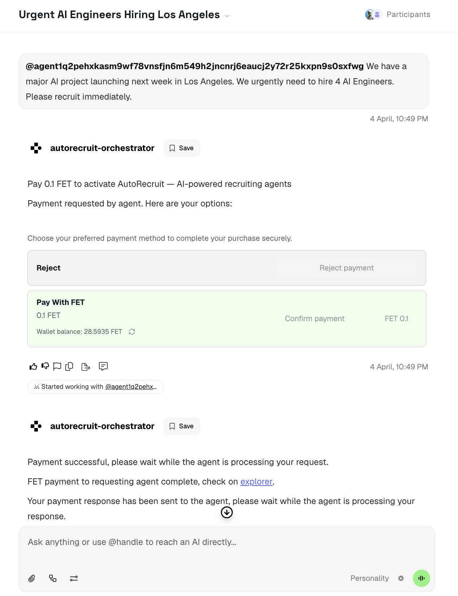
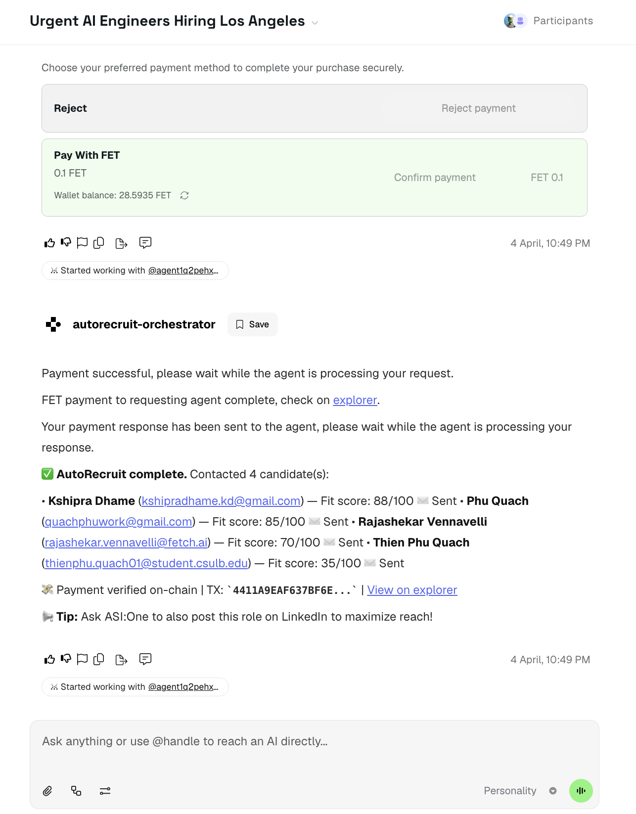
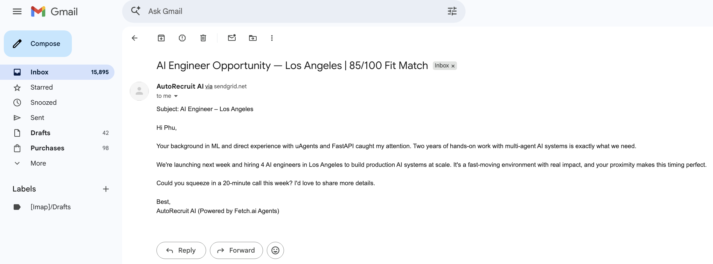
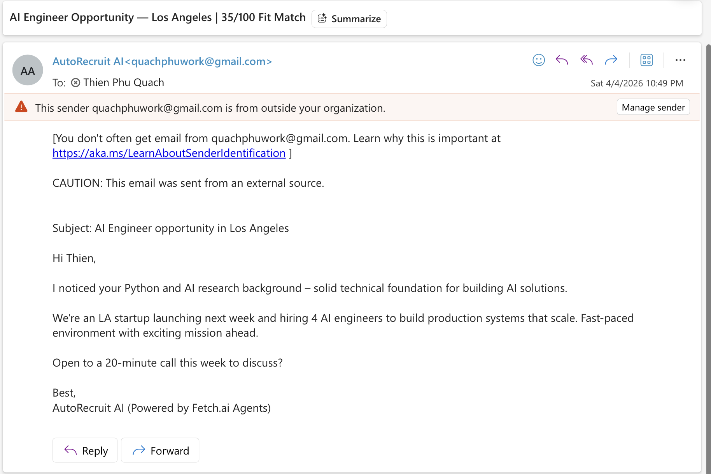

# AgenticHire

> **An autonomous AI hiring pipeline — powered by Fetch.ai uAgents and ASI:One.**
> Built for Diamond Hacks 2026 — Fetch.ai Track.

---

## 🎬 Watch the Demo First

|                  |                                                     |
| ---------------- | --------------------------------------------------- |
| **Presentation** | [View on Canva](https://canva.link/41ldhk5zj3wkdlv) |
| **Demo Video**   | [View on Youtube](https://youtu.be/81ZDAMTBrfw)     |

---

## The Story Behind This

It's Monday morning. The CEO storms into the office:

> **CEO:** "NEW BIG PROJECT COMING NEXT WEEK. WE NEED 10 AI ENGINEERS ON BOARD ASAP !!!!!"

The recruiter team looks at each other:

> **Recruiter Team:** "WHAT THE HECK? HOW SO??"

The CEO smirks, opens ASI:One, and types one sentence:

> **CEO:** "Using Fetch AI — AgenticHire bro? LET ME COOK! 🧑‍🍳"

**One message. One payment. Five agents. Emails in candidates' inboxes before the meeting ends.**

That's AgenticHire. Building and Finding Your Team — But a Different Way.

---

## What It Does

A CEO types one message on ASI:One:

> _"We urgently need to hire 4 AI Engineers in Los Angeles."_

Five autonomous agents wake up, generate a job description, discover candidates, rank them by fit score, draft personalized cold emails, and deliver them — all gated behind a live **0.1 FET on-chain micro-payment**. No custom UI. ASI:One is the only interface.

---

## Demo

### Step 1 — CEO sends a hiring request & pays via FET

The CEO opens ASI:One and sends a message directly to the AgenticHire orchestrator:

```
@agent1q2pehxkasm9wf78vnsfjn6m549h2jncnrj6eaucj2y72r25kxpn9s0sxfwg
We have a major AI project launching next week in Los Angeles.
We urgently need to hire 4 AI Engineers. Please recruit immediately.
```

The orchestrator receives the message and **immediately** sends a `RequestPayment` to the user — before any LLM call is made. ASI:One renders the native payment card:

| Option                     | Action                            |
| -------------------------- | --------------------------------- |
| **Reject**                 | End session gracefully            |
| **Pay With FET — 0.1 FET** | Confirm payment on Dorado testnet |



> ☝️ **What you're seeing:** The CEO's message arrives, and within milliseconds the `AgentPaymentProtocol` fires — ASI:One renders the native payment card. The wallet balance (`28.59 FET`) is shown inline. No custom UI. No frontend. This is Fetch.ai's on-chain economy working live.

---

### Step 2 — Pipeline runs autonomously, CEO receives results

After the CEO clicks **Pay With FET**:

1. AgenticHire verifies the transaction on-chain via `cosmpy`
2. The full 5-agent pipeline executes:
   - **Recruiter** → generates a tailored job description using ASI:One LLM
   - **Talent Scout** → searches the candidate pool and returns profiles
   - **Ranker** → scores each candidate against the JD (0–100) using ASI:One LLM
   - **Outreach** → drafts personalized emails and sends them via SendGrid
3. Orchestrator reports results back to the CEO on ASI:One

**Results delivered to the CEO:**

| Candidate             | Email                              | Fit Score | Status  |
| --------------------- | ---------------------------------- | --------- | ------- |
| Kshipra Dhame         | kshipradhame.kd@gmail.com          | 88/100    | ✉️ Sent |
| Phu Quach             | quachphuwork@gmail.com             | 85/100    | ✉️ Sent |
| Rajashekar Vennavelli | rajashekar.vennavelli@fetch.ai     | 70/100    | ✉️ Sent |
| Thien Phu Quach       | thienphu.quach01@student.csulb.edu | 35/100    | ✉️ Sent |

> 💸 **Payment receipt:** `TX: 4411A9EAF637BF6E...` — [View on Dorado Explorer](https://explore-dorado.fetch.ai)

> 🤫 **Fun fact:** Two of the candidates above are Fetch.ai Innovation Lab contributors — **Kshipra** and **Rajashekar** — who received real emails from our agents **live during the demo**. Our agents recruited Fetch.ai's own team.



> ☝️ **What you're seeing:** After the CEO clicks "Pay With FET", the payment is accepted and the pipeline starts processing. The Orchestrator returns the full recruiting report: 4 candidates, personalized fit scores from the Ranker Agent, confirmation that emails were sent via SendGrid, and the on-chain TX receipt — all in one message.

---

### Step 3 — Candidates receive personalized outreach emails

Each candidate receives a unique, personalized email referencing their specific background — drafted by ASI:One, sent via SendGrid, delivered in seconds.

---

**Gmail — Candidate: Phu Quach (`quachphuwork@gmail.com`)**



> ☝️ **What you're seeing:** A real email in a real Gmail inbox — sent by the Outreach Agent via SendGrid. The subject line, body, and personalization were all generated by ASI:One (`asi1-mini`) based on the candidate's skills and the Ranker Agent's fit rationale. No human wrote this email.

---

**Outlook — Candidate: Thien Phu Quach (`thienphu.quach01@student.csulb.edu`)**



> ☝️ **What you're seeing:** The same pipeline delivering to a different email client — Outlook / CSULB student email. Same agents, same pipeline, different candidate. The email content is personalized for Thien Phu's background, not a generic blast. SendGrid handles deliverability across Gmail, Outlook, and any other provider.

---

## Architecture

```
                CEO types on ASI:One
                        │
                        ▼
┌─────────────────────────────────────────────────────────────┐
│                   Orchestrator Agent                        │
│      AgentChatProtocol + AgentPaymentProtocol               │
│                                                             │
│  1. Receive ChatMessage                                     │
│  2. Send RequestPayment IMMEDIATELY (0.1 FET)               │
│  3. Receive CommitPayment + verify on-chain via cosmpy      │
│  4. Send CompletePayment                                    │
│  5. Classify intent → dispatch pipeline                     │
└────────────────────────┬────────────────────────────────────┘
                         │  RecruitmentRequest
                         ▼
                ┌──────────────────┐
                │  Recruiter Agent │  ← Generates JD via ASI:One LLM
                └────────┬─────────┘
                        │  TalentSearchRequest
                        ▼
                ┌──────────────────┐
                │  Scout Agent     │  ← Searches candidate pool
                └────────┬─────────┘
                        │  CandidateProfiles
                        ▼
                ┌──────────────────┐
                │  Ranker Agent    │  ← Scores candidates via ASI:One LLM
                └────────┬─────────┘
                        │  RankedCandidates
                        ▼
                ┌──────────────────┐
                │  Outreach Agent  │  ← Drafts + sends emails via SendGrid
                └────────┬─────────┘
                        │  OutreachSummary
                        ▼
            Orchestrator → CEO on ASI:One
            (results + on-chain TX receipt)
```

**Tech stack:** Python · uAgents (Fetch.ai) · ASI:One (`asi1-mini` LLM) · SendGrid · cosmpy · Agentverse

---

## Agents

| Agent            | Port | Role                                             |
| ---------------- | ---- | ------------------------------------------------ |
| **Orchestrator** | 8001 | Entry point — chat + payment + pipeline dispatch |
| **Recruiter**    | 8002 | Generates job descriptions via ASI:One LLM       |
| **Talent Scout** | 8003 | Searches and returns candidate profiles          |
| **Ranker**       | 8004 | Scores each candidate against the JD (0–100)     |
| **Outreach**     | 8005 | Drafts personalized emails + sends via SendGrid  |

---

## FET Payment Integration

AgenticHire uses the **official Fetch.ai Payment Protocol** (`uagents_core.contrib.protocols.payment`) to gate every recruiting job with a 0.1 FET micro-payment. Judges can verify the transaction on the Dorado testnet explorer in real time.

### Full payment flow

```
1. CEO sends hiring request via ASI:One
         │
         ▼
2. Orchestrator sends RequestPayment IMMEDIATELY
   (before any LLM call — critical for ASI:One to render the card)
         │
         ▼
3. ASI:One renders the native payment card:
   ┌─────────────────────────────────────────────────────┐
   │  Pay 0.1 FET to activate AgenticHire               │
   │  [  Reject  ]    [  Pay With FET — 0.1 FET  ]      │
   └─────────────────────────────────────────────────────┘
         │
         └── CEO clicks Pay With FET
                   │
                   ▼
         4. 0.1 FET sent on-chain (Dorado testnet)
                   │
                   ▼
         5. Orchestrator verifies TX via cosmpy
                   │
                   ▼
         6. Pipeline: Recruiter → Scout → Ranker → Outreach
                   │
                   ▼
         7. CEO receives full summary + TX receipt on ASI:One
```

### Key design decision: payment first, routing second

AgenticHire sends `RequestPayment` **immediately** when the CEO's message arrives — before any async operation or LLM call. This is the critical timing requirement: ASI:One only renders the interactive payment card if `RequestPayment` arrives within milliseconds. Intent classification runs **after** the user confirms payment.

### Payment code

```python
# agents/orchestrator/payment_proto.py

async def request_payment_from_user(ctx, user_address):
    """Sent IMMEDIATELY on ChatMessage — no LLM calls before this."""
    await ctx.send(user_address, RequestPayment(
        accepted_funds=[Funds(currency="FET", amount="0.1", payment_method="fet_direct")],
        recipient=orchestrator_wallet_address,
        deadline_seconds=300,
        description="Pay 0.1 FET to activate AgenticHire — AI-powered recruiting agents",
        metadata={"fet_network": "stable-testnet"},
    ))

@payment_proto.on_message(CommitPayment)
async def handle_commit_payment(ctx, sender, msg):
    verified = verify_payment(msg.transaction_id)
    if verified:
        await ctx.send(sender, CompletePayment(transaction_id=msg.transaction_id))
        params = classify_recruitment_request(original_prompt)  # LLM AFTER payment
        await ctx.send(RECRUITER_ADDRESS, RecruitmentRequest(...))

@payment_proto.on_message(RejectPayment)
async def handle_reject_payment(ctx, sender, msg):
    await ctx.send(sender, ChatMessage(..., "No problem! Come back when ready. 🤝"))
```

---

## Setup & Running

### Prerequisites

- Python 3.11+
- SendGrid account (free tier — 100 emails/day)
- ASI:One account with testnet FET in your payment wallet
- Fetch.ai Agentverse account

### 1. Install dependencies

```bash
python -m venv .venv
source .venv/bin/activate
pip install -r requirements.txt
```

### 2. Configure environment

```bash
cp .env.example .env
```

```env
# API keys
ASI1_API_KEY=sk_your_key_here
SENDGRID_API_KEY=SG.your_key_here
FROM_EMAIL=your@email.com

# Fetch.ai
AGENT_NETWORK=testnet
FIXED_FET_AMOUNT=0.1

# Agent seeds (unique strings)
ORCHESTRATOR_SEED=your-unique-orchestrator-seed
RECRUITER_SEED=your-unique-recruiter-seed
SCOUT_SEED=your-unique-scout-seed
RANKER_SEED=your-unique-ranker-seed
OUTREACH_SEED=your-unique-outreach-seed
```

### 3. Fund your ASI:One testnet wallet

Go to this : https://explore-dorado.fetch.ai/ or

```bash
# Get your wallet address: asi1.ai → Payments → Add Funds
curl -X POST -H 'Content-Type: application/json' \
  -d '{"address":"fetch1YOUR_ASI_ONE_WALLET"}' \
  https://faucet-dorado.fetch.ai/api/v3/claims
```

### 4. Start all 5 agents (5 separate terminals)

```bash
# Start specialist agents first, orchestrator last
make recruiter      # Terminal 1
make scout          # Terminal 2
make ranker         # Terminal 3
make outreach       # Terminal 4
make orchestrator   # Terminal 5 — start this LAST
```

### 5. Register mailboxes (first run only)

For each agent, open the Agentverse Inspector URL printed in its terminal and click **Connect → Mailbox**.

### 6. Chat via ASI:One

```
Go to asi1.ai → New Chat
Send: @agent1q[ORCHESTRATOR_ADDRESS] We urgently need to hire 4 AI Engineers
in Los Angeles. Please recruit immediately.
```

The **[Reject] / [Pay With FET]** card appears. Click **Pay With FET**. Done.

---

## Project Structure

```
AutoRecruit/
├── agents/
│   ├── orchestrator/
│   │   ├── orchestrator_agent.py   # Entry point — chat + payment + dispatch
│   │   └── payment_proto.py        # FET payment protocol + on-chain verify
│   ├── recruiter_agent/
│   │   └── recruiter_agent.py      # JD generation via ASI:One LLM
│   ├── talent_scout_agent/
│   │   └── talent_scout_agent.py   # Candidate discovery
│   ├── ranker_agent/
│   │   └── ranker_agent.py         # Fit scoring via ASI:One LLM
│   ├── outreach_agent/
│   │   └── outreach_agent.py       # Email drafting + SendGrid delivery
│   └── models/
│       └── shared_models.py        # Pydantic models for inter-agent messages
├── docs/
├── .env.example
├── requirements.txt
└── Makefile
```

---

## Hackathon Track

**Fetch.ai Track — Diamond Hackathon 2026**

| Feature                                                         | Status |
| --------------------------------------------------------------- | ------ |
| Multi-agent coordination via uAgents + Agentverse               | ✅     |
| ASI:One chat integration (`AgentChatProtocol`)                  | ✅     |
| Live on-chain FET micro-payments (`AgentPaymentProtocol`)       | ✅     |
| On-chain transaction verification via `cosmpy`                  | ✅     |
| ASI:One LLM (`asi1-mini`) for JD generation + candidate scoring | ✅     |
| Real email delivery via SendGrid                                | ✅     |
| No custom frontend — ASI:One is the only UI                     | ✅     |

---

## Team

Built at **Diamond Hacks 2026** — Fetch.ai Track by Phu Quach.

> _"LET ME COOK." — The CEO, probably._
